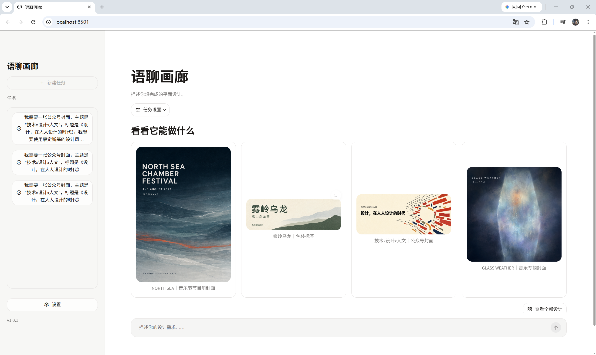

# Corpus Atelier

Corpus Atelier is a local AI-assisted tool for creating graphic designs from natural-language requests.

Use it when you have a subject, message, or communication goal but want help turning it into a concrete visual direction and a finished graphic. Corpus Atelier interprets the request, develops one or more design proposals, lets you review them before image generation, and produces downloadable images.

It is suitable for posters, article covers, social-media graphics, invitations, labels, album covers, and other graphic-design tasks. The design process can be guided by rhetorical strategies or art and design movements.



## Install

Corpus Atelier runs locally on your computer. You will need:

- Git
- Python 3.10 or later
- An OpenAI API key

### Windows

Open PowerShell and run:

```powershell
git clone https://github.com/666feiyu666/corpus-atelier.git
cd corpus-atelier

py -m venv .venv
.\.venv\Scripts\Activate.ps1

python -m pip install -r requirements.txt
python -m streamlit run src/corpus_atelier/streamlit_app.py
```

### macOS

Open Terminal and run:

```bash
git clone https://github.com/666feiyu666/corpus-atelier.git
cd corpus-atelier

python3 -m venv .venv
source .venv/bin/activate

python -m pip install -r requirements.txt
python -m streamlit run src/corpus_atelier/streamlit_app.py
```

Corpus Atelier will open in your browser. On first use, open **Settings** and enter your OpenAI API key.
